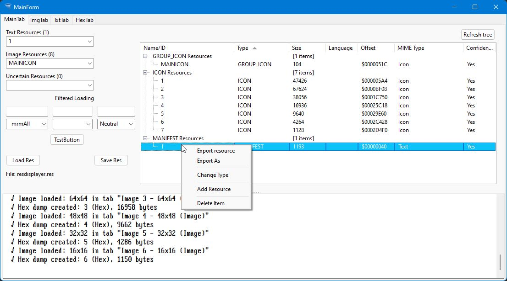
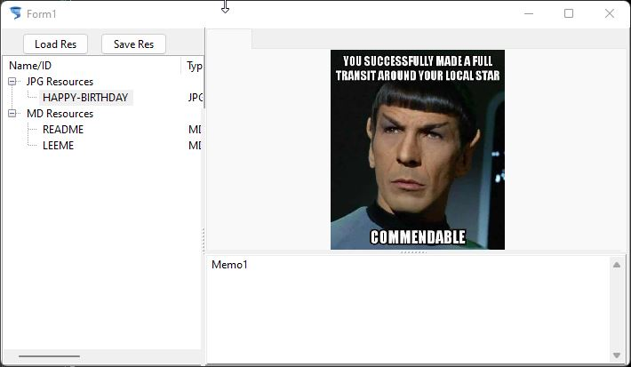

# ETResPackage - Windows Resource File (.res) Management

[](https://github.com/Chafalleiro/ETRes/releases)

[](LICENSE)

This package provides a set of units and visual components for reading, editing, importing, and exporting Windows resource files (.res). It includes a functional API (`uResOperations`) that can be used directly in console or GUI applications, as well as two visual components for Lazarus/Typhon: `TETResExplorer` (viewer) and `TETResEdit` (editor).

## Package Contents

### Source Files

- `uResDefs.pas` – Basic definitions (types, records, constants).
- `uResFile.pas` – Low-level functions for reading/parsing .res files.
- `uResManager.pas` – In-memory resource manager.
- `uResUtils.pas` – Reconstruction utilities (icons, bitmaps, text).
- `uMimeDetect.pas` – MIME type detection from streams.
- `uResFileIO.pas` – Export/import of individual resources.
- `uResOperations.pas` – **Unified API** for all operations. This is the main entry point to use the functionality without a GUI.
- `uAddRes.pas` / `.frm` – Resource import dialog (used by components).
- `ETResControls.pas` – Visual components `TETResExplorer` and `TETResEdit`.
- `ETResDsgn.pas` – Design-time property editors (optional).

## API Functions (`uResOperations`)

The `uResOperations` unit exposes all operations on .res files in a simple and documented way. Below is a summary of the most important functions. For more details, see the comments in the source code.

### Initialization and Files

- `ResOp_Initialize: Boolean` – Initializes the system (must be called once at startup).
- `ResOp_Shutdown: Boolean` – Releases resources and closes files.
- `ResOp_OpenFile(const FileName: string): Boolean` – Opens a .res file and loads its resources.
- `ResOp_CloseFile: Boolean` – Closes the current file without saving.
- `ResOp_SaveFile(const FileName: string = ''): Boolean` – Saves changes to the specified file (if omitted, saves to the currently open file).
- `ResOp_GetFileName: string` – Returns the name of the current file.

### Queries

- `ResOp_GetResourceCount: Integer` – Number of resources.
- `ResOp_GetAllResources: TResListArray` – List of all resources.
- `ResOp_GetTextResources: TResListArray` – Only text resources.
- `ResOp_GetImageResources: TResListArray` – Only image resources.
- `ResOp_FindResource(const Name: string; const ResType: TResType): Integer` – Finds a resource by name and type.
- `ResOp_GetResourceInfo(Index: Integer; out Info: TResInfo): Boolean` – Detailed information about a resource.

### Editing Operations

- `ResOp_LoadResource(const Params: array of const): TMultiResLoadResult` – Loads resources with full control (same as `ResMgr_LoadResource`).
- `ResOp_RenameResource(Index: Integer; const NewName: string; AutoSave: Boolean = False): Boolean` – Changes the resource name.
- `ResOp_ChangeResourceType(Index: Integer; const NewType: TResType; AutoSave: Boolean = False): Boolean` – Changes the resource type.
- `ResOp_DeleteResource(Index: Integer; AutoSave: Boolean = False): Boolean` – Deletes a resource.
- `ResOp_AddResource(const Name: string; const ResType: TResType; Data: TMemoryStream; LanguageID: Word = 0; AutoSave: Boolean = False): Integer` – Adds a new resource from a stream.
- `ResOp_ImportResource(const FileName: string; const ResourceName: string; const ResType: TResType; LanguageID: Word = 0; AutoSave: Boolean = False): Boolean` – Imports a resource from an external file.
- `ResOp_ExportResource(const ResourceName, ResTypeName: string; Param: Integer): Boolean` – Exports a resource to a file (the `Param` parameter controls dialogs: 0=all, 2=no filename, 4=silent).

### Utilities

- `ResOp_GetLastError: string` – Last error message.
- `ResOp_TypeFromInt(Value: Integer): TResType` – Creates a `TResType` from an integer.
- `ResOp_TypeFromString(const Value: string): TResType` – Creates a `TResType` from a string.
- `ResOp_TypeToString(const ResType: TResType): string` – String representation of the type.
- `ResOp_ValidateResourceName(const Name: string; const ResType: TResType): Boolean` – Checks if the name is valid for the given type.
- `ResOp_FindFreeOrdinalName(const BaseName: string; ResTypeInt: Integer): string` – Finds an unused ordinal name.

## Visual Components

### TETResExplorer

Resource explorer with tree view and quick export options.

**Main Properties:**
- `FileName: string` – .res file to display (with design-time editor).

**Methods:**
- `procedure LoadFromFile(const AFileName: string)` – Loads a file.
- `procedure Refresh` – Reloads the list from the currently open file.
- `function GetSelectedResource: Integer` – Returns the index of the selected resource, or -1.

**Events (can be added if needed):**
- `OnResourceSelected` – Triggered when a resource is selected.
- `OnExport` – Before/during export.

### TETResEdit

Inherits from `TETResExplorer` and adds editing capabilities: rename, change type, import, delete, add.

**Additional Methods:**
- `procedure SaveToFile(const FileName: string)` – Saves changes to the file.
- `procedure OpenFileDialog` – Opens a dialog to select a file.

**Note:** At design time, when you assign the `FileName` property, the component will attempt to load the file automatically. If the file does not exist, it remains empty.

## Usage Examples

### Without GUI, Only API

```pascal
program TestRes;

uses
  uResOperations;

var
  ResList: TResListArray;
  I: Integer;
begin
  if not ResOp_Initialize then
  begin
    WriteLn('Error initializing');
    Exit;
  end;

  if ResOp_OpenFile('myfile.res') then
  begin
    ResList := ResOp_GetAllResources;
    for I := 0 to High(ResList) do
      WriteLn(ResList[I].Name, ' (', ResList[I].DisplayType, ') ', ResList[I].Size, ' bytes');
    ResOp_CloseFile;
  end
  else
    WriteLn('Error: ', ResOp_GetLastError);

  ResOp_Shutdown;
end.
```

### With Visual Component

1. Drop a TETResExplorer onto a form.

2. In the Object Inspector, click the "..." button next to the FileName property and select a .res file.

3. The tree will automatically populate with the resources.

4. To export, right-click on a resource and choose "Export Quick" or "Export As...".

### Requirements
+ Free Pascal 3.0+ / Lazarus 2.0+ or Typhon.

+ virtualtreeview_package (VirtualTrees) installed in the IDE.

### Installation

1. Open ETResPackage.lpk in Typhon/Lazarus.

2. Compile the package.

3. Install the package (rebuild the IDE if needed).

4. The components will appear on the "ET Controls" palette.

### Additional Notes

+ .res files can contain up to 65535 resources. The package handles any reasonable amount.

+ Icon and cursor resources (including groups) are handled correctly.

+ MIME detection is based on stream content, so it is reliable even without file extensions.


### More about .res files

Their flexibility and fast access make them very convenient for including files and data without the need for databases, compressors, archivers, or the operating system's file system.

They are neither compressed nor encrypted, but since they are essentially a file container, we can include encrypted and compressed files if we need a resource not to be readable outside our application or control.

Currently, .res files have evolved from the early 16-bit Windows versions to accommodate more options, but they still have basically the same structure: A sequential file with fixed-size records and variable-length fields.

+ The record size is always 32-bit (DWORD).

+ Fields are divided into fixed-length fields for specific data such as language, size, offset, or version, and variable-length fields for fields like name, resource type, or the resource itself. They are organized into a header and content; the header has a specific field order, and at the end of it, the resource begins.

+ When a field is variable, its records are read sequentially until an end marker (null byte or zero) is found, or until we read the marker of a new field in the next record.

+ When writing data, we write record by record, padding the field tail with zeros once its data has ended.

+ There are special resources that originated from the intention to save space in older systems, when storage space was much more limited than today (floppy disks, CDs, hard drives below 1 GB...), and they are formatted by removing headers to share them among the records stored under that type. RT_BITMAP and GROUP_* belong to this category. Others, to maintain encoding compatibility, change the first bytes of the resource, such as TXT. There are also resources that can be executed from Windows to store forms; this program does not handle that information.

+ The MANIFEST type can be used to store relevant version information of the file. Executables from Lazarus and Typhon, and if specified in other IDEs like Codeblocks, can store this information in an XML and in the version field, which Windows will read.

### Very interesting documentation on the format can be found here:

  [Moon Soft - win32 resource file format](https://www.moon-soft.com/program/FORMAT/windows/res32.htm)

+ Two very comprehensive programs for managing resources and all their features can be found here:

  [Resource Hacker](https://www.angusj.com/resourcehacker/)

  [RisohEditor](https://katahiromz.web.fc2.com/re/en/)

+ Wikipedia entry with updated links to Microsoft's sparse information here:
  [Windows resource file](https://en.wikipedia.org/wiki/Resource_(Windows))

### Examples


#### Res Displayer. API tester.

 A resource explorer and editor showing the capabilities of ETRes package, uses many of the functions, some from their lower lever units, but mainly from uOperations, the main API entry point. Youll find the source under the Exampler dir as a typhon project. It should be compatible with Lazarus. Has in code comments and instructions.
 
 Uses its own tree to display data.
 


#### ETResEdit control tester.

Show how to use the Edit control shipped with the packake. Load and save a file, get streams and display them in the UI. imports, rename, delete or move resources are managed by the control.



### API Details

  [API MD](Operations_functions.md)
  
  [API HTML](Operations_functions.html)


### ☕ Café virtual

[](https://ko-fi.com/chafalleiro)
[](https://patreon.com/u25697686?utm_medium=unknown&utm_source=join_link&utm_campaign=creatorshare_creator&utm_content=copyLink)
[](https://www.paypal.com/donate/?hosted_button_id=JQKD5VZ2FCYH2)

### 💎 Criptomonedas

**Ethereum / BSC / Polygon:**
[](https://app.uniswap.org/portfolio/0x62f830706b0Dd6B6753e27272A3A21ab8f4a328e)

## License
You are free to use this code in your projects, whether commercial or not. If you make improvements, consider sharing them. 
